🌍 $Echo Sync – Smart E-Waste Management Platform$
♻️ Recycling the Future, One Device at a Time

Echo Sync is a full-stack smart e-waste management platform designed to connect citizens, local kirana partners, and eco-admin teams into one unified digital ecosystem.

It gamifies e-waste disposal, rewards responsible recycling, and enables real-time monitoring of collection and bin management.

🚀 Problem Statement

India generates millions of tons of electronic waste every year.
Most small e-waste (chargers, earphones, batteries, small devices) ends up:

❌ In household dustbins

❌ In landfills

❌ Causing toxic environmental damage

There is a lack of:

Organized small e-waste collection

Incentive for citizens

Tracking system for waste management

💡 Solution – Echo Sync

Echo Sync provides:

✔ A single application
✔ Multiple user roles
✔ Smart collection system
✔ Reward-based recycling
✔ Real-time tracking
✔ Analytics for better waste management
📉 The Real-World Problem

Electronic waste is one of the fastest growing waste streams in the world.

In India alone:

Millions of tons of e-waste are generated every year.

Small electronic waste (chargers, earphones, batteries, adapters, cables, broken phones) often:

Gets thrown in household trash.

Ends up in landfills.

Releases toxic materials like lead and mercury.

Pollutes soil and groundwater.

❗ Why Is Small E-Waste a Big Problem?

Large appliances sometimes go to recycling centers.

But small electronics:

Are ignored.

Are inconvenient to dispose properly.

Have no incentive system.

Lack organized collection.

There is:

❌ No gamified motivation.

❌ No structured tracking system.

❌ No community-level collection.

❌ No visibility for waste authorities.

💡 Our Solution
Echo Sync builds a smart ecosystem.

Instead of expecting people to go to recycling centers:

We bring recycling into the neighborhood.

🔄 How?

We convert local Kirana stores into micro e-waste collection hubs.

We reward users for responsible disposal.

We give admins real-time tracking and analytics.

🏗️ Architecture Overview

Single Application
Multiple Dashboards
Role-Based Access

👥 User Roles

USER → Citizens

PARTNER → Grocery Store Owners

ADMIN → Eco-Sync Operations Team

Each role sees a dedicated dashboard with different functionalities.
📱 Platform Features Overview
👤 User Dashboard

AI-based waste scan (mock detection)

QR generation

Points wallet

Leaderboard

Nearby store map

Pickup request

Rewards redemption

🏪 Partner Dashboard

QR code scanning

Bin fill status monitoring

Daily transactions

Earnings tracking

Pickup request submission

🧑‍💼 Admin Dashboard

All bins map view

Pickup scheduling

User management

Partner management

Analytics dashboard

Recycler reports

✨ Key Features
👤 User Dashboard

📷 AI-based E-Waste Scan (mock detection)

🎁 Points & Wallet System

🗺 Nearby Partner Stores (Map Integration)

🚚 Doorstep Pickup Request

🏆 Leaderboard

🎟 Rewards & Redemption

🔳 QR Code Generation

🏪 Partner Dashboard

🔍 QR Code Scanner

🗑 Bin Fill Status Monitor

💰 Earnings Tracker

📊 Daily Transactions

🚛 Bin Pickup Request

🧑‍💼 Admin Dashboard

🗺 All Bin Status (Color-coded Map)

📦 Pickup Scheduling & Management

🚐 Van Routing

👥 User & Partner Management

📈 Advanced Analytics Dashboard

📑 Recycler Reports
🔄 How the System Works (Step-by-Step Flow)
👤 Step 1 – User

User signs up.

Uploads/Scans small e-waste.

Generates QR code.

Visits nearby partner store.

Drops waste in smart bin.

Partner scans QR.

User earns eco-points.

🏪 Step 2 – Partner (Grocery Store)

Acts as local collection center.

Scans QR codes from users.

Tracks bin fill levels.

Requests pickup when bin is full.

Earns commission per transaction.

🧑‍💼 Step 3 – Admin

Monitors all bins on map.

Approves pickup requests.

Tracks waste volume.

Analyzes performance.

Generates reports.

🛠 Tech Stack
🎨 Frontend

React (Vite)

Tailwind CSS

React Router

Recharts (Analytics)

Leaflet (Maps)

Framer Motion (Animations)

Context API

⚙ Backend

Node.js

Express.js

MongoDB

Mongoose

REST APIs

MVC Architecture

🗄 Database

MongoDB Atlas

Aggregation Pipelines for Analytics

🔐 Authentication

Simple Login & Signup

Role-based routing

No JWT (basic session using localStorage)

Role-controlled dashboard rendering

🎬 Special Feature – Animated Smart Bin Intro

When the app opens:

Small e-waste items fall into a smart animated recycling bin
The bin fills up
Eco message appears
Then smoothly transitions to the app

This gives the platform a premium and engaging startup feel.

📊 Analytics Capabilities

Total e-waste collected

Revenue tracking

Monthly growth trends

Top performing partners

Leaderboard ranking

Waste category distribution (Pie chart)

🧠 How It Works

1️⃣ User signs up and selects role
2️⃣ Users scan or drop e-waste
3️⃣ Partner verifies via QR
4️⃣ Points are credited
5️⃣ Admin monitors collection and pickups
6️⃣ Waste is routed to recyclers

📁 Project Structure
Echo-Sync/
│
├── frontend/
│   ├── components/
│   ├── pages/
│   ├── context/
│   ├── services/
│
├── backend/
│   ├── models/
│   ├── controllers/
│   ├── routes/
│   ├── middleware/
│   ├── seed/
│
└── README.md
⚡ Installation & Setup
1️⃣ Clone Repository
git clone <your-repo-url>
cd Echo-Sync
2️⃣ Backend Setup
cd backend
npm install
npm start
3️⃣ Frontend Setup
cd frontend
npm install
npm run dev
🌱 Future Enhancements

Real AI waste detection

IoT smart bins integration

Blockchain-based recycling tracking

Government compliance dashboard

Mobile app (React Native)

Real-time notifications

🎯 Impact Vision

Echo Sync aims to:

Reduce small e-waste pollution

Incentivize responsible disposal

Empower local businesses

Enable data-driven waste management

Create a cleaner and greener ecosystem

🏆 Why This Project Matters

E-waste is one of the fastest-growing waste streams globally.

Echo Sync is not just an app —
It is a sustainable ecosystem.
## 📸 Project Screenshots
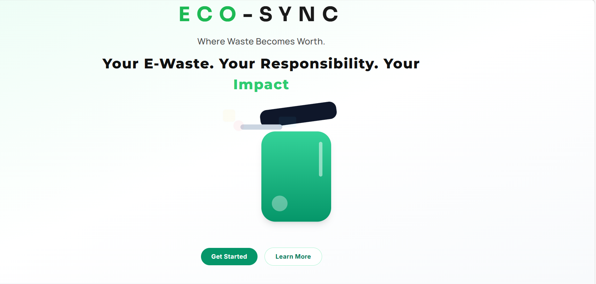
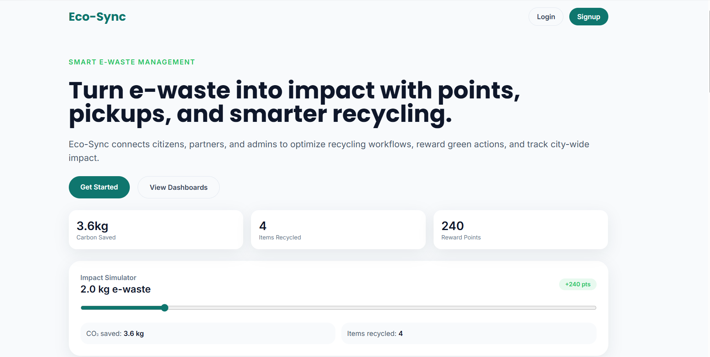
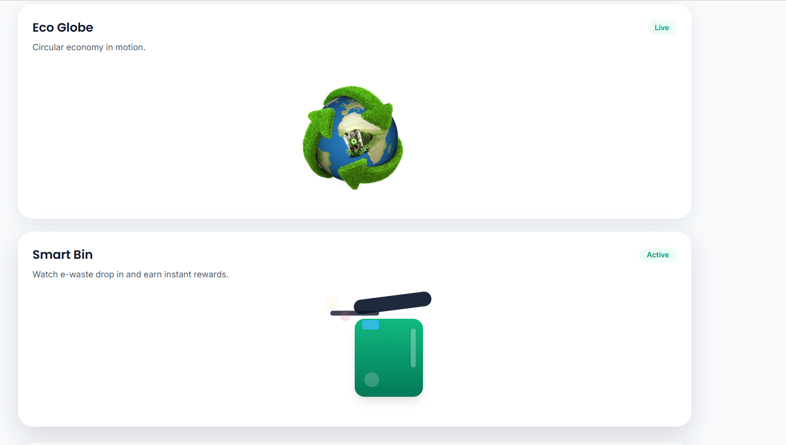
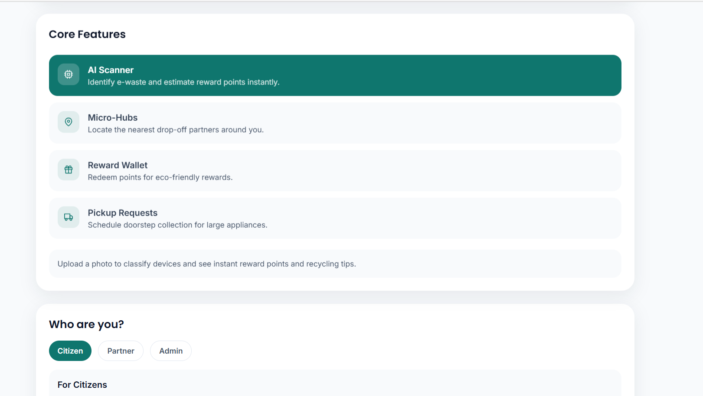
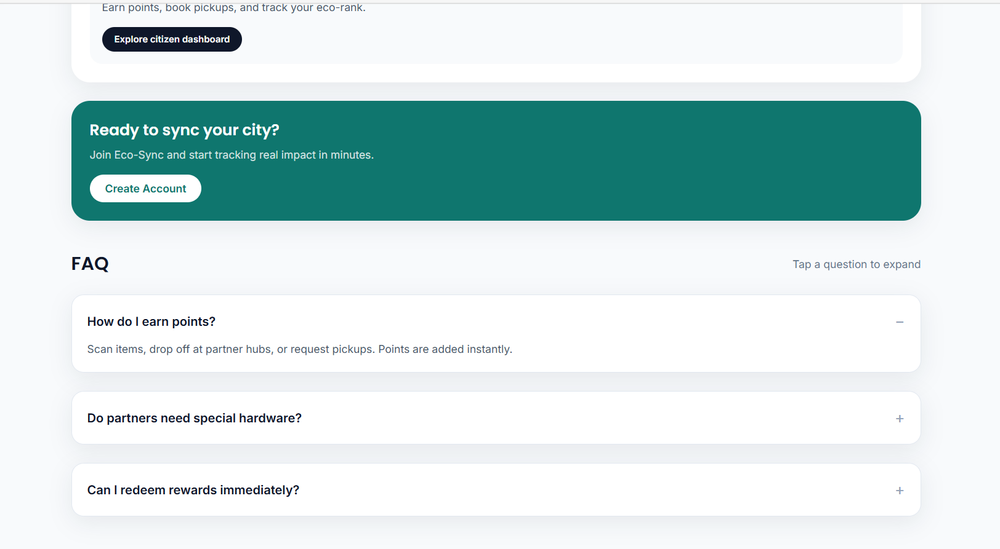
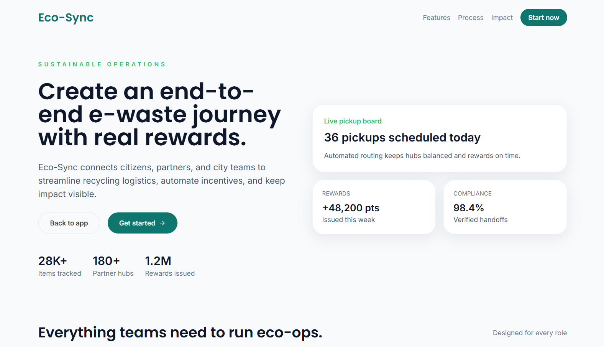
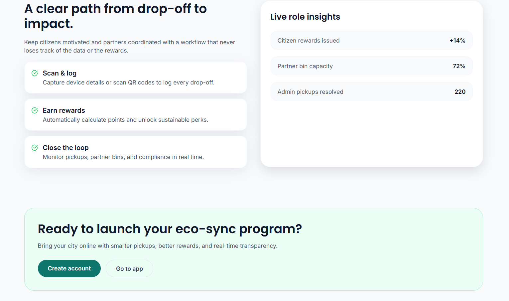
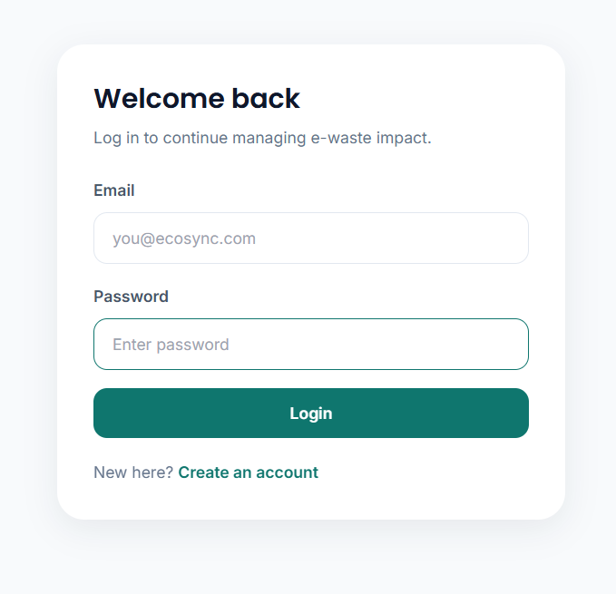

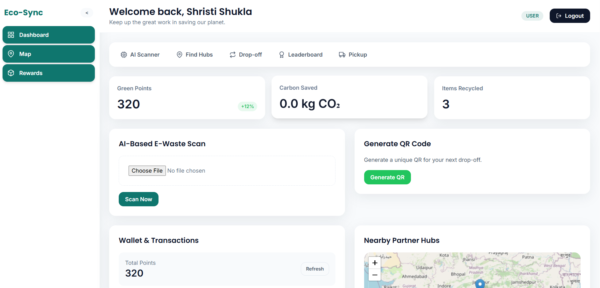
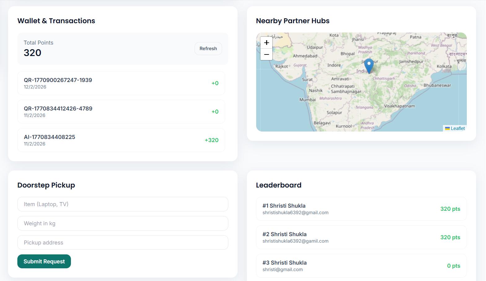
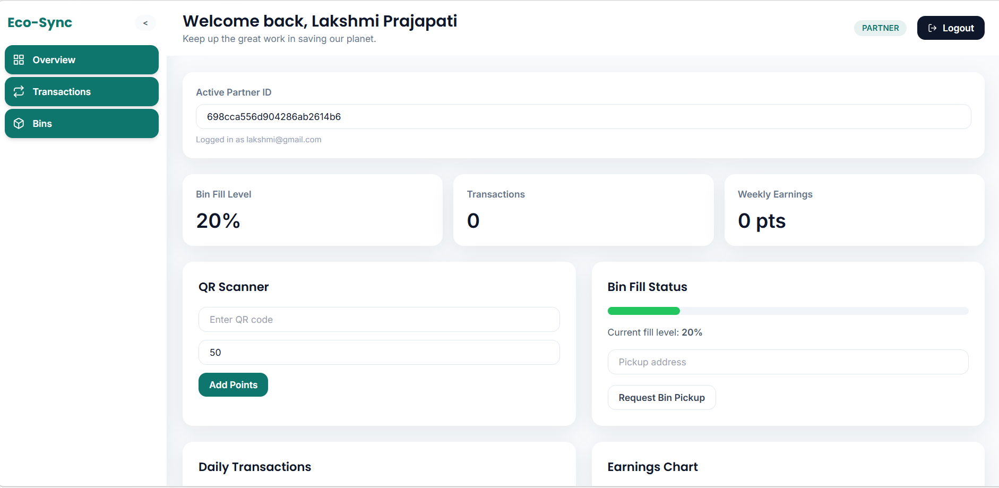
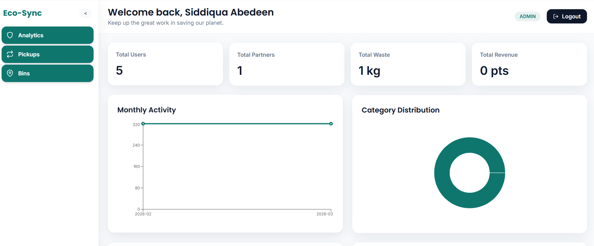
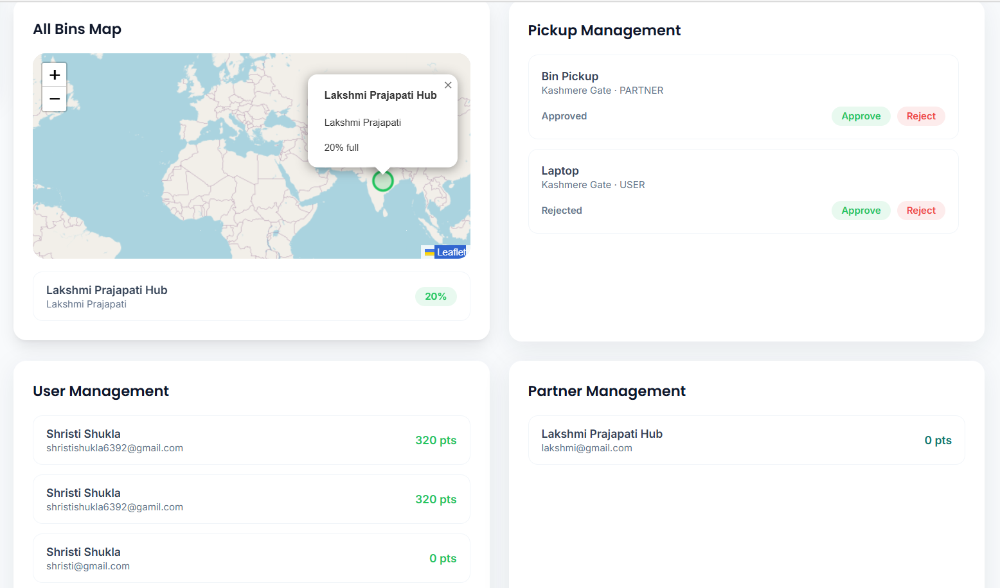

👩‍💻 Developed By

Shristi Shukla
Full Stack Developer | Sustainability Enthusiast

🌍 Tagline

*“Your E-Waste. Your Responsibility. Your Impact.”*
